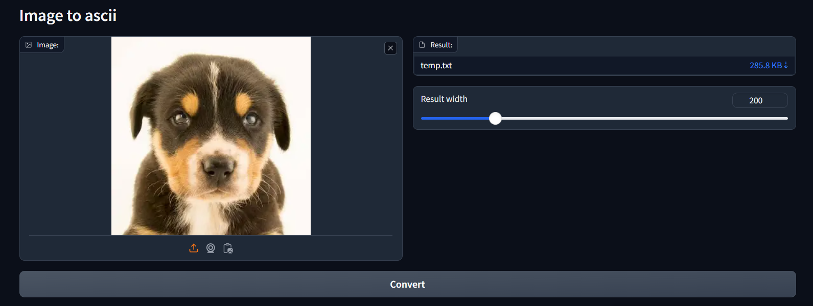
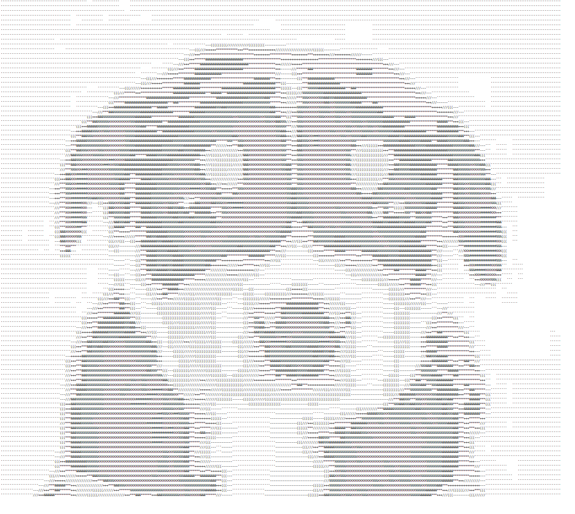

# Image to ascii

After you upload your image and click 'Convert' it will return a txt file.
Before transforming it, the image is resized. With the slider you can choose the width, the height will be calculated accordingly

